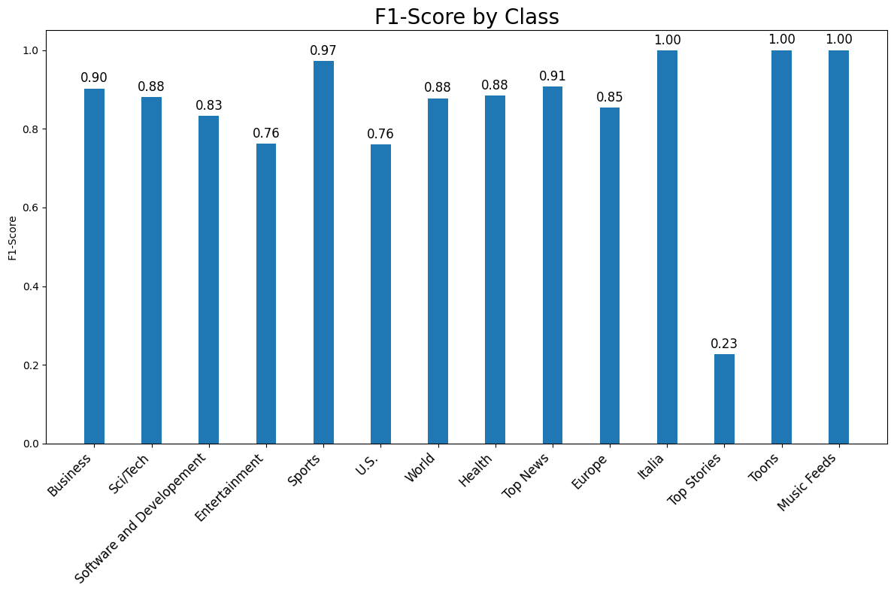
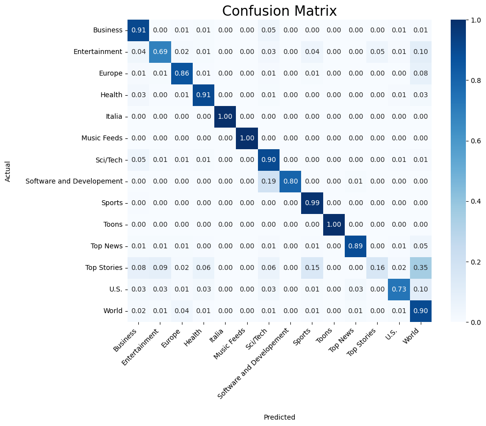

# News category classification

## Data
AG's corpus of news articles: http://groups.di.unipi.it/~gulli/AG_corpus_of_news_articles.html  
  
To recreate the cleaned version of the data set which was used for training, use the get_clean_data() function from utils.py.  
  
---
  
---
  
Data cleaning process:
- Remove data points with missing titles and descriptions
- Concatenate description and title to article column
- Filter out articles with less than 20 tokens and more than 250 tokens
- Filter out datapoints which don't have a unique label (some data points appear multiple times in the dataset with multiple labels. For training only datapoints with unique labels have been used)

## Model
For the classification task an XLNet-base-case instance has been finetuned (https://huggingface.co/xlnet/xlnet-base-cased).  
XLNet is an autoregressive language model based on the Transformer architecture that models the permutation of the factorization order of tokens in a sequence.  

## Training Process
For training and evaluating the model a train-dev-test split of 80-10-10 has been used.
All 3 sets were sampled to keep the label distribution of the overall dataset.  
Because of the highly imbalanced class distribution complementary class weights have been used for fine-tuning the model.  
  
**Hyperparameters**:
| Hyperparameter       | Value   |
|----------------------|---------|
| Batch Size (Train)   | 48      |
| Learning Rate        | 2e-5    |
| Number of Epochs     | 2       |
| Adam Epsilon         | 1e-6    |

## Results

**Overall:**

| Metric        | Precision | Recall | F1-Score |
|---------------|-----------|--------|----------|
| Accuracy      |           |        |   0.89   |
| Macro Avg     |   0.87    |  0.84  |   0.85   |
| Weighted Avg  |   0.89    |  0.89  |   0.89   |

---

**Per class:**

| Class                     | Precision | Recall | F1-Score |
|---------------------------|-----------|--------|----------|
| Business                  |   0.90    |  0.91  |   0.90   |
| Sci/Tech                  |   0.86    |  0.90  |   0.88   |
| Software and Development  |   0.87    |  0.80  |   0.83   |
| Entertainment             |   0.85    |  0.69  |   0.76   |
| Sports                    |   0.96    |  0.99  |   0.97   |
| U.S.                      |   0.79    |  0.73  |   0.76   |
| World                     |   0.86    |  0.90  |   0.88   |
| Health                    |   0.86    |  0.91  |   0.88   |
| Top News                  |   0.92    |  0.89  |   0.91   |
| Europe                    |   0.85    |  0.86  |   0.85   |
| Italia                    |   1.00    |  1.00  |   1.00   |
| Top Stories               |   0.39    |  0.16  |   0.23   |
| Toons                     |   1.00    |  1.00  |   1.00   |
| Music Feeds               |   1.00    |  1.00  |   1.00   |  

---

  

---

  
